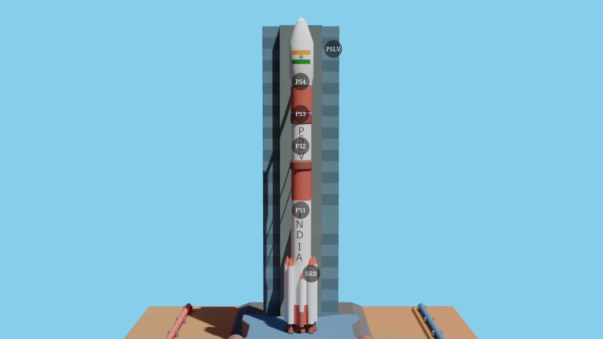

# Threejs_rockets
A three js scene with PSLV. Just completed three js journey course, and to test what I've learned, decided to make a small scene integrating threejs with HTML.

Made a low poly PSLV model in blender, UV unwrapped it, baked the textures, and exported it. Imported the model into threejs, and integrated it with the HTML loading screen and some other HTML elements. Hosted the whole project on Github Pages. Along with threejs, Vite js was used.

# SCREENSHOT

# Check github pages DEMO
[CLICK HERE](https://vaishnav.github.io/threejs_rockets/)

